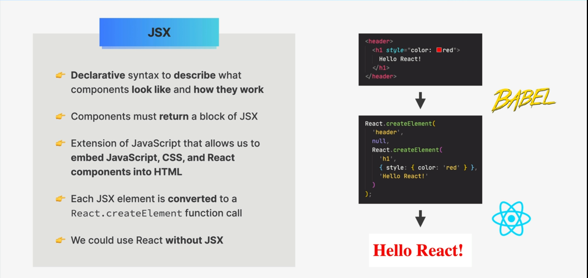
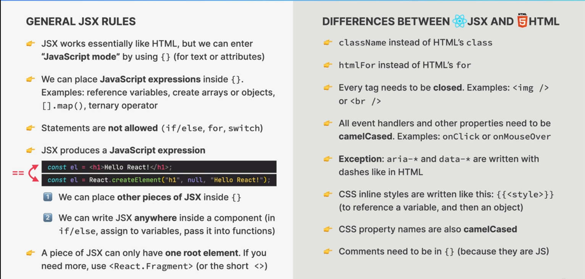
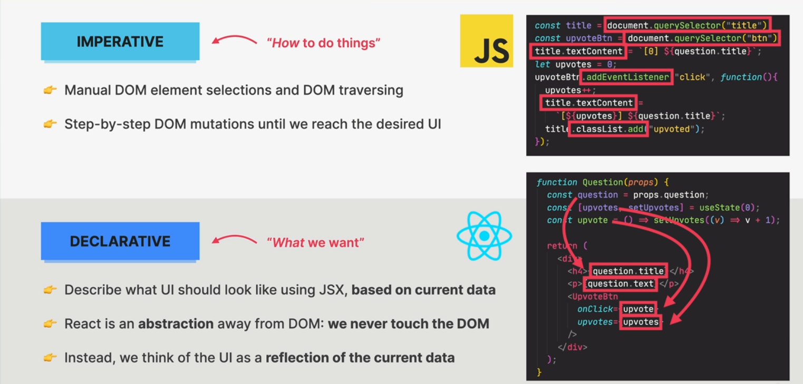
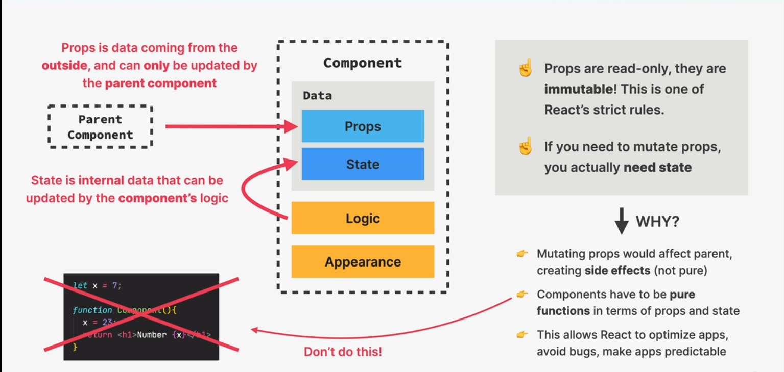

# Components , Props and JSX

## Components


### _2 important components as function rules in react_

- The first letter of a component name should be capitalized
- Function needs to retirn some markup(JSX) or null.

### Components tree

- A hierarchical structure of React components
- Each node represents a component, edges represent parent-child relationships
- Used by React to manage rendering and updating of components
- Example:

```jsx
<AppComponent>
  <Header />
  <MainContent>
    <Sidebar />
    <Article />
  </MainContent>
  <Footer />
</AppComponent>
```

Becomes:

```
AppComponent
  ├── Header
  ├── MainContent
  │   ├── Sidebar
  │   └── Article
  └── Footer
```


## JSX (JavaScript XML)



### JSX vs HTML



### JSX is declarative

- "declarative" refers to a programming paradigm where you describe what you want to see in your UI, rather than how to achieve it.



### Basic styling in React

- If we want to write inline css we have to use **{{}}** double curly brackets , 1st brackets for javaScript writing second for object. Becasue class is reserved word in js , So we use **className** to add classe's in react.

```js
function Header() {
  return (
    <h1 style={{ color: "red", fontSize: "48px", fontStyle: "uppercase" }}>
      Fast React Pizza CO.
    </h1>
  );

  // Adding classes
  // This type of styling is global scoped so it is not recomended for big apps

  function App() {
    return (
      <div className="container">
        <Header />
        <Menu />
        <Footer />
      </div>
    );
  }
}
```

## Props in React

- Short for "properties"
- Way to pass data from parent to child component
- Immutable (can't be changed by child component)
- Passed like function arguments
- Can be any data type (strings, numbers, booleans, arrays, objects, functions eveb other components)

```js
// Parent component
function Menu() {
  return (
    <main className="menu">
      <h2>Our Menu</h2>
      <Pizza
        name="Pizza Spinaci"
        ingredients="tomato, mozarella, spinach, and ricotta cheese"
        photoName="pizzas/spinaci.jpg"
        price={18}
      />

      <Pizza
        name="Pizza Funghi "
        ingredients="tomato, mozarella"
        photoName="pizzas/funghi.jpg"
        price={18 + 3}
      />
    </main>
  );
}

// Child component
function Pizza(props) {
  return (
    <div className="pizza">
      
      <div>
        <h3>{props.name}</h3>
        <p>{props.ingredients}</p>
        <span>{props.price}</span>
      </div>
    </div>
  );
}
```

### props are immutable but why ?



### Destructuring Props in React

```js
const Greeting = ({ name }) => {
  return <h1>Hello, {name}!</h1>;
};
```

- In this example, we define a Greeting component that expects a name prop, which is extracted using destructuring props.

### Rendering a list element

- why not use **forEach**? because map creates a separate array with a **JSX** but forEach does not create separate array with jsx , So if we use forEach react can not render anything.

```js
<ul className="pizzas">
  {pizzaData.map((pizza) => (
    <Pizza pizzaObj={pizza} key={pizza.name} />
  ))}
</ul>
```

## Conditional Rendering

- why not use **if else** . Because if....else does not produce any value. They simply execute different blocks of code based on a condition. In React, we need to return a value (i.e., JSX elements) from our components

### **&&** Operator

- We can conditionally render something using the `&&` operator's short-circuiting behavior.
- If the first value is true, the second value will be rendered. If the first value is false, the second value will not be rendered.

**Example:**

```js
function Footer() {
  const hour = new Date().getHours();
  const openHour = 12;
  const closeHour = 22;
  const isOpen = openHour >= hour && hour <= closeHour;
  return (
    <footer className="footer">
      {isOpen && (
        <div className="order">
          <p>
            We are currently open until {closeHour}:00. Come visit us or order
            online
          </p>
          <button className="btn">order</button>
        </div>
      )}
    </footer>
  );
}
```

### Ternary **(?:)** operator

- we can add an extra piece jsx if we use ternary operator

**Example**

```js
function Footer() {
  const hour = new Date().getHours();
  const openHour = 12;
  const closeHour = 22;
  const isOpen = openHour >= hour && hour <= closeHour;
  return (
    <footer className="footer">
      {isOpen ? (
        <div className="order">
          <p>
            We are currently open until {closeHour}:00. Come visit us or order
            online
          </p>
          <button className="btn">order</button>
        </div>
      ) : (
        <div className="closed">
          <p>We are currently closed. Please come back later.</p>
        </div>
      )}
    </footer>
  );
}
```

### Conditional rendering with multiple returns

- When we need a different component conditionally not just a piece of jsx we can use conditional rendering with multiple returns

  **Example**

```js
function Pizza(props) {
  if (props.pizzaObj.soldOut) return null;

  return (
    <li className="pizza">
      
      <div>
        <h3>{props.pizzaObj.name}</h3>
        <p>{props.pizzaObj.ingredients}</p>
        <span>{props.pizzaObj.price}</span>
      </div>
    </li>
  );
}
```

## React fragments

- **Definition:** A React Fragment is a type of component that allows you to group a list of children without adding extra nodes to the DOM.

**Example:**

```jsx
function MyComponent() {
  return (
    <>
      <h1>Hello</h1>
      <p>World!</p>
    </>
  );
}

function MyComponentWithKey() {
  return (
    // If we want to add Key we have to write like this
    <React.Fragment key="">
      <h1>Hello</h1>
      <p>World!</p>
    </React.Fragment>
  );
}
```

- **Purpose:** Fragments are useful when you need to return multiple elements from a component, but don't want to add an extra HTML element to the DOM. They are also useful for reducing the number of DOM nodes in your application.
